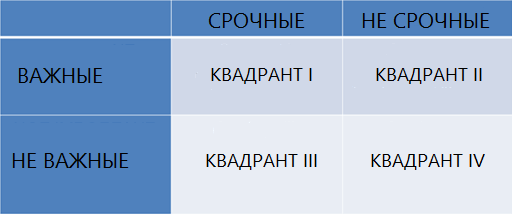
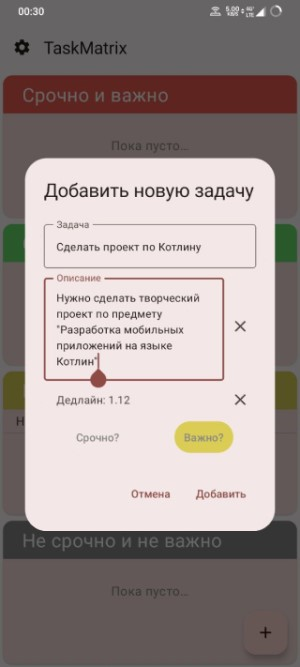
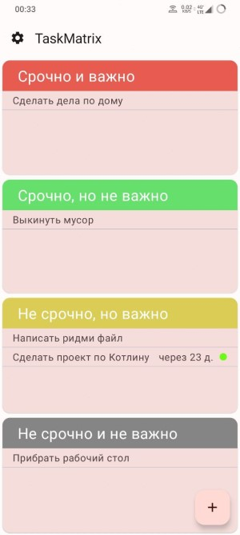
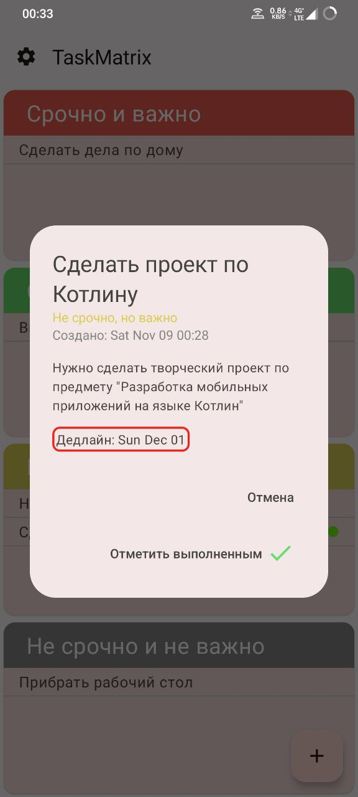
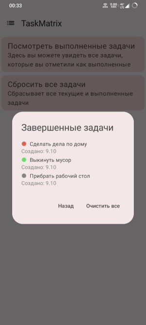

# Описание
TaskMatrix - приложение таск-трекер для создания задач, их упорядочивания и отслеживания дедлайнов. Приложение, согласно идее матрицы Эйзенхауэра, позволяет разделить задачи на 4 категории:
1. Важно и срочно
2. Важно, но не срочно
3. Не важно, но срочно
4. Не важно и не срочно

  
Матрица Эйзенхауэра

  

Данное упорядочивание позволяет более четко расставить приоритеты и оптимизировать рабочий процесс.
Также приложение имеет индикаторы, сообщающие о наступлении крайнего срока какой-либо задачи (если он был задан).
Задачи можно отмечать, как выполненные, после чего они будут исчезать с главного экрана пользователя.
# Структура проекта
Приложение написано с использоваинем clean-архитектуры, и разделено на модули:
1. App
2. Domain
3. Data
Используются паттерны репозиторий и MVVM.
# Стек проекта
Kotlin, Jetpack Compose, Room, Koin, Coroutines, Compose Navigation.
# Скриншоты приложения

  
Скриншоты

  
  
  
  
  

